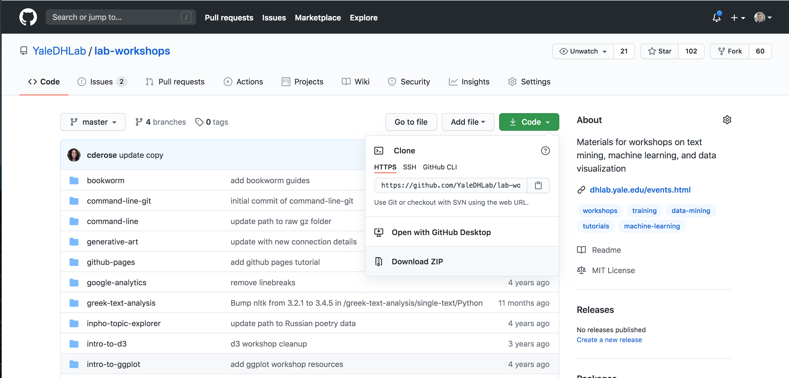

# First Steps with Python

This workshop offers an introduction to the Python programming language. By working through this workshop, users will come to learn some of the most important building blocks in Python, and will have a chance to start creating simple but powerful Python programs on their own.

## Getting Started

To access the tutorial from a Google Colab environment, click on <a href='https://colab.research.google.com/drive/16nVU7bgFEhgkFdDwARKWg86kV3Q0-rLX?usp=sharing' target='_blank'>Google Colab notebook</a>. Once you have the Colab notebook open, click on "Copy to Drive" near the top of the notebook to create a local copy of the notebook, to which you can add your own notes and code.

  
To access the tutorial as a Jupyter Notebook, try following the steps below.

**Step One: Install Anaconda**

To get started with this notebook, you should first [install the Anaconda distribution of Python](https://www.anaconda.com/products/individual#Downloads).

**Step Two: Download Workshop Notebook**

Once Anaconda is installed, you'll need to download the notebook for this workshop. To do so, you can visit https://github.com/YaleDHLab/lab-workshops, click the green "Code" button at the top of the page, then click the "Download ZIP" button:



Save that zip archive to your Desktop, then double click the zip archive to expand it.

**Step Three: Start a Terminal**

Next, you'll need to start a terminal. The method for starting a terminal will differ based on your operating system:

| Operating System | Command                                            |
|---------|-------------------------------------------------------------|
| Mac     | type COMMAND+SPACE_BAR, type <i>terminal</i>, and hit ENTER |
| Windows | go to Programs/Apps -> Anaconda3 -> Anaconda Prompt         |

**Step Four: Direct Terminal to Lab Workshops Folder**

Once your terminal is running, we need to move the terminal into the "lab-workshops" folder on your desktop. To accomplish this goal, we can use the "cd" command. The "cd" command stands for "change directories" (directory is a fancy term for a folder). Specifically you should run the command below that corresponds to your operating system:

| Operating System | Command                             |
|------------------|-------------------------------------|
| Mac              | `cd ~/Desktop`                      |
| Windows          | `cd C:\Users\YOUR_USERNAME\Desktop` |

Note that Windows users will need to replace YOUR_USERNAME above with your username on your computer.

**Step Five: Start the Workshop Server**

Now that your terminal is on your desktop, we can start the notebook by running the following command in your terminal:

```bash
jupyter notebook
```

This command should open a webpage with several folders. Click the folder that says "first-steps-with-python", then click the file labelled "first-steps-with-python.ipynb". Once you've finished this step, you'll be ready to work through this workshop!
